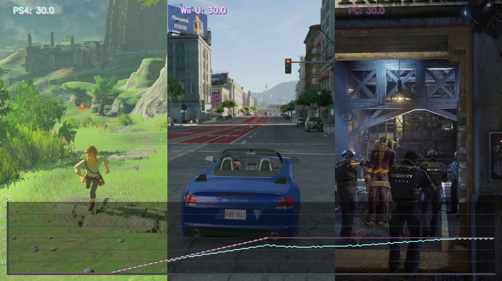

# T(ea)RDrop 

trdrop - a cross platform fps analyzer for raw video data 

## Description

This software is used for analyzing raw video data, calculating framedrops and visualizing tears.
The result can be exported with an overlay displaying the information. For a more detailed description, look up the documentation in [docs](docs/documentation.pdf).

## Releases

Current releases are found [here](https://github.com/cirquit/trdrop/releases). (watch out - still an alpha)

## Features

* fps feature extraction
* support for up to three videos
* csv logger
* plot visualization
* configuration via a `yaml` file
* support for comparison of different resolution videos
* configurable output resolutions

