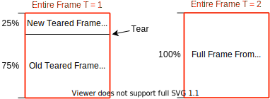

<p align="center">
    
</p>

# trdrop - v2.0.0
###### ˈtɛr-dɹɑp - a raw video analysis program

## Examples

TODO

## Description

The main use of this software is to estimate the "real" framerate of **an uncompressed video**.

Usually, a dedicated [capture card](https://en.wikipedia.org/wiki/Video_capture) is employed to capture the video stream with a fixed framerate of a console. To estimate the real framerate of the console, we check for differences on a frame-by-frame basis and count the different frames. This results in the "real" **framerate**.

The same is done with the **frametime**, as we count the amount of time a single frame is shown.

We also try to detect [**frametears**](https://en.wikipedia.org/wiki/Screen_tearing) and incorporate them into the framerate and frametime calculation.

Hence the name **tr** (short for tear) and a framerate **drop**.

## How to Run the Program

* [Releases](https://github.com/cirquit/trdrop/releases)
* [Linux/Windows Build Instructions](BUILD_INSTRUCTIONS.md)

## Development

## Features

* **Video input resolution**
    - Min: `20x20`
    - Max: `4096x2160`
* **Video export resolution**
    - Min: `640x480` (minimum plot + text resolution)
    - Max: `7680x4320`
* **Export as**
    - Imagesequence: `.png`, `.jpg`, `.tiff`, `.bmp`
    - Video:
        + Container: `.webm`, `.mp4`, `.avi`
        + Encoders: `VP9`, `AV1`, `H264`, `H265`
    - Text:
        + `.csv`
* **General features**
    - Framerate estimation
        + No limits on maximum framerate
        + Adjustable color tolerance
    - Frametime estimation
        + No limits on maximum frametime
    - Plots
        + Enable/Disable centering
        + Adjustable font and colors
        + Adaptable maximum plotting range
    - Framerate text
        + Automatic positioning
        + Adjustable font and colors
    - Export as overlay
        + with an alpha channel: `.tiff`, `.png`, `VP9`
        + with a greenscreen: `.png`, `.jpg`, `.tiff`, `.bmp`, `VP9`, `AV1`, `H264`, `H265`
    - Compositions
        + Save/Load
    - Difference frame analysis (a black/white image that shows absolute differences between consecutive frames)
    - Export queue
    - Run the analysis without exporting
    - Saved preferences on close


## How Do We Compare Frames

Whatever pixel format from the source video (`RBG`, `HSV`, `HSL`, `YUV`), we convert it to the [`CIELAB` (L\*a\*b)](https://en.wikipedia.org/wiki/CIELAB_color_space) color space.

While we can compare consecutive frames irregardless of the source pixel format, to implement the *tolerance* functionality we need a definition of difference for a single color.

Due to CIELAB being more-or-less perceptually uniform, we can use the euclidean distance function to quantify how similar two colors are.
Example on how the tolerance works:

```
Color 1: L1, A1, B1
Color 2: L2, A2, B2
Difference: sqrt( (L1 - L2)^2 + (A1 - A2)^2 + (B1 - B2)^2 )

# for all pixels in two frames
If ( Tolerance > Difference )
    Then
        "Frame is same"
    Else
        "Frame is different"
```

Please note that in previous releases (`< v2.0.0`), we converted each color to greyscale and compared these 8-bit values.

This is obviously prone to mistakenly detect two initially different colors as the same (RBG has `255^3 = 16,581,375` colors, while greyscale has only `255`). 

While these false-positives should not be a big problem in practice, the current solution should be more accurate.

## How Do We Include Tears In The Framerate/-time Calculation

Because we have not found any resources, we just decided by ourselves how to include them into the calculation.
Please feel free to create a proposal if you know a better way.

To calibrate how a teared frame gets counted we created the "tear tolerance" value `[0, 100]`. It defines how big a frame has to be to be counted as a new frame. Let's take this example of a tear at the frame at `time = 1`:

<p align="center">
    
</p>

* **Case 1**: If the tear tolerance is set to `0%`, that means the entire frame counts as a new frame, irregardless of how big the new teared frame is.

* **Case 2**: If the tear tolerance is set to `30%`, that means the entire frame counts as old frame, because `30% > 25%`. 

Next, the frame at `T=2`, the remaining part of the `T=1` frame is filled up.

In both cases, we ignore that tears were detected which leads to `T=2` being classified as a new frame because the bottom `75%` part is different.

Generally, **whenever a tear is detected** the calculated **Framerate and Frametime should not be taken as correct**.

## Disclaimer

trdrop is a free, open-source project we develop in our spare time. While we do our best to make it as accurate as possible, we cannot guarantee that it is free of errors.

We **do not take responsibility** for analysis errors or inaccuracies that might damage or improve the reputation of any brand or organization. trdrop is not an accurate scientific tool, but merely a demonstration of different algorithms.

## Contributing

trdrop is created with the [Qt framework](https://www.qt.io/) and [ffmpeg](https://ffmpeg.org/). Please follow the [DEVELOPMENT.md](DEVELOPMENT.md) guidelines to get started.

## License

[MIT License](https://en.wikipedia.org/wiki/MIT_License). Commercial use is allowed.

Please note that parts of this program are sublicensed under the LGPL (ffmpeg and Qt), so selling this program will lead to legal actions.