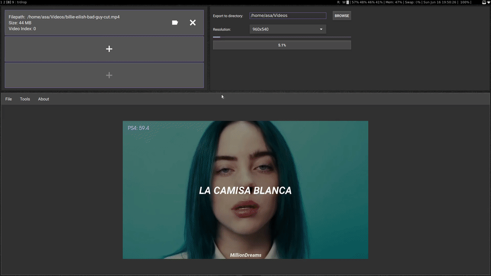
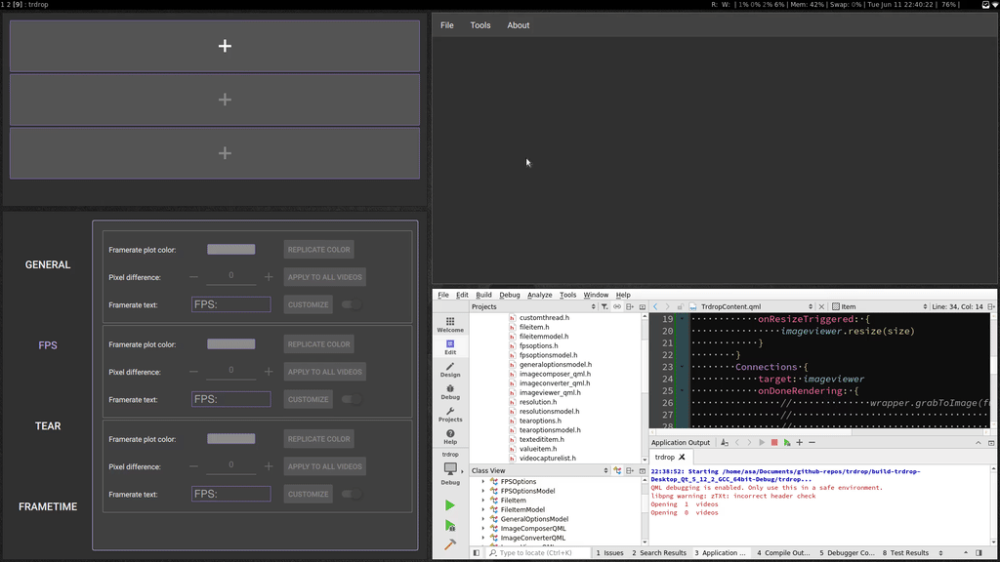

trdrop - a cross platform fps analyzer for raw video data

#### Update 23.06.2019

Not a very gif'able update, but I've rewritten the processing pipeline and grouped the headers by usage. A problem I've encountered was that I could not save images which were outside of the screen-resolution, which prompted me to rewrite some parts, but that is now also fixed.
The only thing to test right now is the conversion between internal qt images to opencv to encode a new video. This should be only a matter of time, but then it's only about adding the missing features, which should not prove to be as difficult as the project structure until now.

#### Update 17.06.2019

Finally got the Framerate Text working on resize and for multiple videos simultaneously.

#### Update 11.06.2019

Options are now enabled dependent on the amount of the videos that are selected. I also got some text overlay from the options rendered over the video, currently working on making it scale by size.

#### Update 10.06.2019

Resizing from export dialog works, even live. Default export location is movies on every platform (os-indepedent). Composing now works too, but not automatic centering if the ratio is different (16:9) -> (4:3) will produce black beams, may fix this later.

#### Update 08.06.2019

Started with the export dialog, got progress bar working, an export button and started with choosing the directory. Also working on the composing tool for multiple videos and automatic resizing, but as you can see in the gif some of the image channels are still wrongly displayed.

#### Update 02.06.2019

Fused the FileDialog with the rendering for up to 3 videos in parallel. Currenlty still rendering only one video at a time. The Rendering Button is for debugging purposes, will be the export window in the future.

#### Update 31.05.2019

Working Video playback in QML from OpenCV, now giving the FileDialog the functionality behind the scenes. After this we will try some overlays

#### Update 28.05.2019

Got OpenCV finally to show videos in a QWidget. Now it's up to do that in QML.

#### Update 23.05.2019

Added more general options with a custom spinbox with text. Also tearoptions with a shared color option. Tooltips work on the general pane but not the others yet? Also got OpenCV running from a previous project on Linux, now porting it to Windows.

#### Update 20.05.2019

Added the Framerate options with a color picking / font picking / text editing functionality. Also added a reset settings button.

[Webm this time, gif convertion failed](images/2019-05-20-fps-options-progress.webm)

#### Update 16.05.2019

Started with the options menu. Colorpicking works!

#### Update 14.05.2019

Got the fileitemmodel working with c++ and qml. Added transition animations because they look good. Now focusing on the options dialog. Hopefully this will be faster as the model will be the same implementation as the fileitem one.

.

#### Update 12.05.2019

Created the qt branch, currently building up the knowledge needed to use the Qt MVC model. Rebuilding the QML example to work from C++ to incorporate OpenCV.

This is the current progress video for the file choose dialog with ordering.

.

#### Update 24.04.2019

I'm currently working on a cross platform (Win/Linux) Qt based implementation. Currently testing some of the key functionalities in private repos. Stay tuned!

