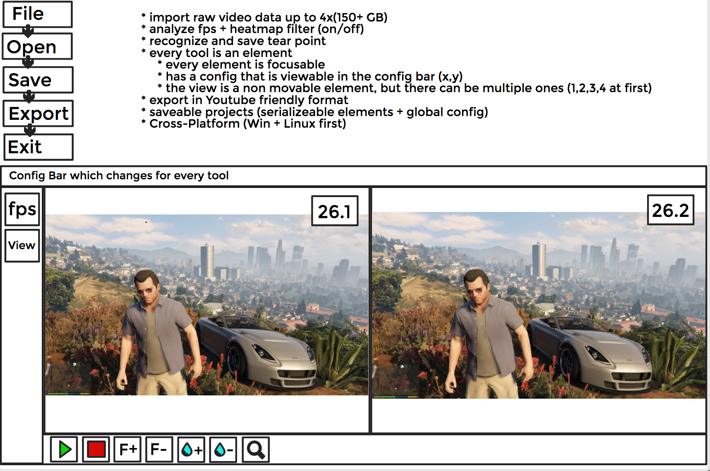

# T(ea)RDrop

trdrop - a cross platform fps analyzer for raw video data

#### Description

This software is used for analyzing raw video data, calculating framedrops and visualizing tears.
The result can be exported with an overlay displaying the information.

#### Cross Platform

This project is based of `Qt 5.8` with an embedded OpenGL viewport and `libvlc`. It will be developed for Linux and Windows. MacOS will maybe supported in the future.

#### Usage

The user will be presented a simple GUI with following functionality

#### Milestones

**Nr.1:**
    * run QT on Linux
    * setup a build system, learn simple cmake, qt-developer
    * setup travis
**Nr.2:**
    * create a simple gui with a viewport which can load a raw video
    * create a custom fps field which has a predefined settings and let is calculate the fps
    * create the run/stop buttons
    * run QT on Windows and test the previous work
**Nr.3:**
    * refactor the fps field as a tool and make it selectable
    * create the config bar with the settings of the currently selected element
    * make it *responsive*
    * make elements delete'able
    * create the "view"-tool, which adds another viewport
    * create the File-Menu (only Open + Exit)
**Nr.4:**
	* implement YT-friendly Export with fps overlay
    * implement frameskip +1 / -1
    * create keybindings for everything
    * implement drag'n'drop for viewports
    * create the analyze tool for tears
        * save tear-time and allow jumps to tears
        * show the probably used time for the analysis
**Nr.5:**
    * allow serialization for configuration
        * save
        * load 
	* save configs and tears for videos based on filename

**Extra goodies:**
    * mouse based translation for elements
	* video time, current time for the selected viewport
		* possibility to jump to frame through click
	* text field
		* font
		* size
		* color
	* fps field
		* add color
	* safe config and tears for videos based on some specially picked frames and hash + compare
	* multi select for elements
		* translation with mouse
		* translation with keyboard
 		* change same properties in config bar
	* allow alignment via mouse based on every center/edge of elements for every element
		* show it interactivly like on `slides.com`
	* viewports are moveable via mouse and can be moved interactivly
	* multiple export settings, not only for `yt`
	* possibility to open multiple files, not only `raw`
	* test on Mac

