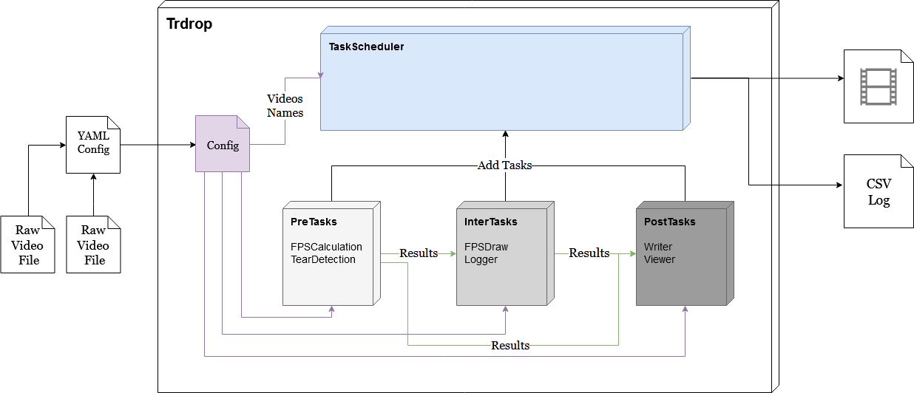

# T(ea)RDrop Concepts

### System Diagram

   

We want an interface that hides the iteration through the videos and automatically parallelizes as many tasks as possible.
In our case the user has three possible tasks which will be plugged in the `TaskScheduler`